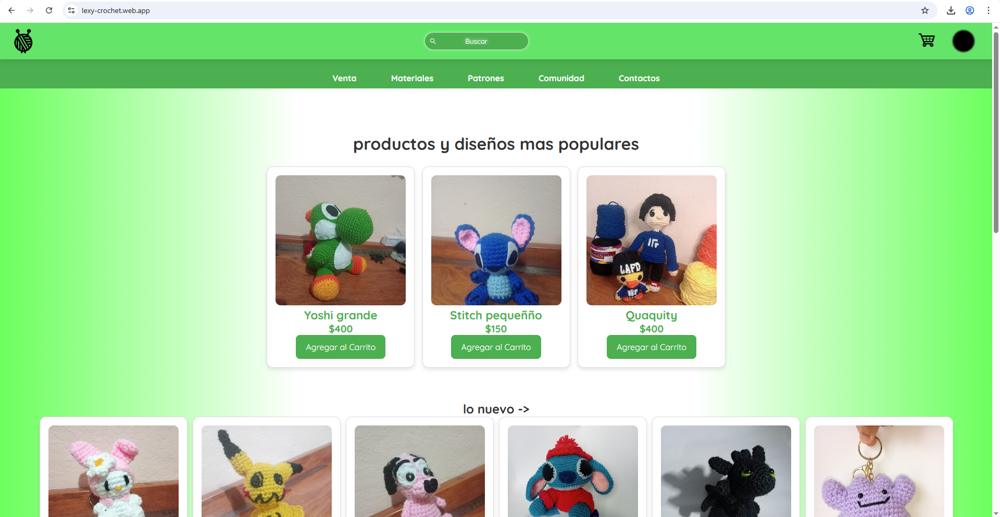

# Lexy Crochet

Sitio web de tienda online de productos crochet (amigurumis, materiales, patrones, comunidad).

## Tecnologías usadas

- Framework web: (p. ej. React, Vue, Angular, o simplemente HTML/CSS/JS).
- Librería UI o CSS: (Bootstrap, Tailwind, Material UI).
- Backend / base de datos: (Firebase, Node.js, etc.) — si aplica.

## Vista previa

## Secciones destacadas

- **Venta**: listado de productos disponibles.
- **Materiales**: materiales para crochet.
- **Patrones**: patrones disponibles para descargar o comprar.
- **Comunidad**: espacio para compartir trabajos o tutoriales.
- **Contactos**: información o formulario de contacto.
- **Login / Registro / Mi Perfil**: autenticación de usuarios.

